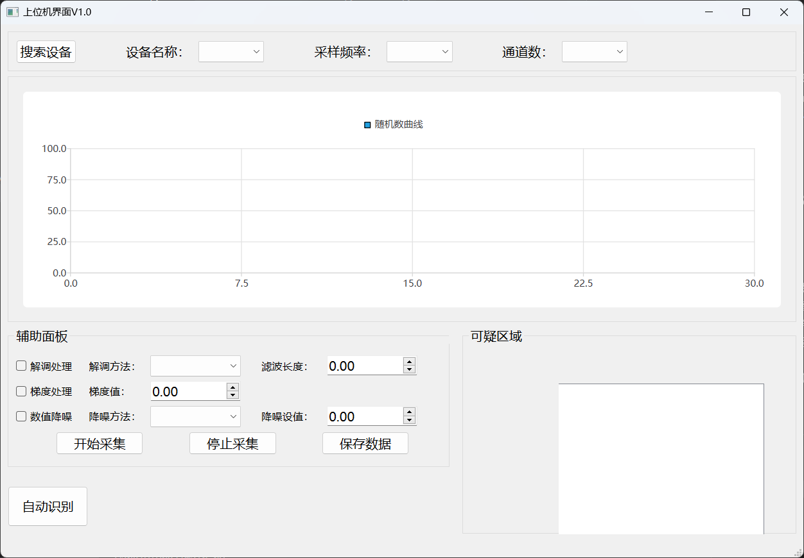
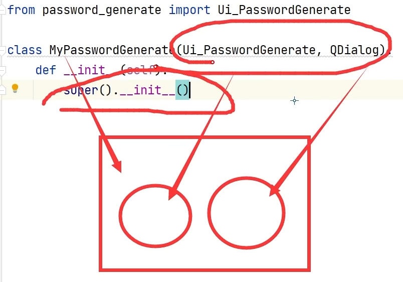

# 采集卡上位机

Created time: September 19, 2022 3:42 PM
Last edited time: September 29, 2022 12:44 AM
Status: In progress
🧑‍💻 Software: <https://www.notion.so/Qt-Pyslide-3b52c98538ed448c9ced7fb2419e4076>

## 结果展示

[video1.mp4](2.images/video1.mp4)


## 需求（更新时间22-9-28）

**核心：**

- [x]  基本布局UI界面
- [x]  UI界面拖动组件自适应
- [x]  启动程序创建一个监听实例，并且开始监听
- [ ]  点击搜索设备按钮，在设备combbox中显示建立连接的设备ip
- [x]  使用QtNetwork的connect等信号/槽函数代替python的thread和socket
- [x]  点击开始采集按钮，能够接受客户端发来的数据，并实时显示在chart中
- [x]  自己的独立数据帧格式，确保前后两个数据不粘连(还有一点问题待用时间作为X轴验证)
- [ ]  X轴变为时间
- [ ]  引入多条数据的同步显示
- [ ]  客户端保持静默，在点击采集按钮后，发送一个指令，客户端接收到指令后，再开始发数据（ps:可以使用tcp的三次握手作为标志而不需要额外的指令（待确定））

**其他：**

- [ ]  引入日志管理，在ui界面添加一个log显示框
- [ ]  状态栏鼠标悬停实现功能介绍
- [ ]  添加菜单栏功能
- [ ]  整理算法功能函数的接口

## 动态更新

### 用list去做

[Python list列表实现栈和队列 - 简书 (jianshu.com)](https://www.jianshu.com/p/c1df38332484)

### 平滑动态更新，实现滑动轴

[Qt | 利用QtChart实现动态曲线实时绘制显示_雍正不秃头的博客-CSDN博客_qtchart](https://blog.csdn.net/qq153471503/article/details/122078179#:~:text=%E5%85%B7%E4%BD%93%E4%BD%BF%E7%94%A8%E6%AD%A5%E9%AA%A4%E4%B8%BA%EF%BC%9A,%E4%B9%8B%E5%85%B3%E8%81%94%E7%9A%84%E5%9D%90%E6%A0%87%E8%BD%B4%E3%80%82)

[使用Qchart实现曲线移动更新_froxy的博客-CSDN博客_qchart使用](https://blog.csdn.net/froxy/article/details/78358488)

### 双轴&时间

[QChart双Y轴实时更新曲线图 - 简书 (jianshu.com)](https://www.jianshu.com/p/2c584fa2e469)

## need import

pip install pyside6

---

# Qt&PySide（笔记）

Created time: September 16, 2022 4:11 PM
Last edited time: September 28, 2022 6:42 PM
Status: In progress
Tags: 代码框架

## 安装

**~~Qt creator安装：~~ (用不到)**

~~Qt creator 6.0 后仅支持在线安装，在一下目录选择版本下载~~

[~~Index of /archive/online_installers/4.4 (qt.io)~~](https://download.qt.io/archive/online_installers/4.4/)

~~注意勾选对应的MinGW编译器~~

**PySide和Vscode安装：**

[VSCode+PySide6开发环境搭建 - 知乎 (zhihu.com)](https://zhuanlan.zhihu.com/p/511300853)

PySide6 使用Anaconda安装`pip install pyside6`

注意配置uic、acc等的地址

## 新建项目

~~计划使用Qt for Python & Qt Quick制作项目~~

>辣鸡：qml文件在Qt Creator的designer界面无法添加Qtcharts组件（未解决）
>
> <https://github.com/librehat/yapstocks/issues/5>
>
> <https://github.com/barche/QML.jl/issues/118>
>
1. 在vscode中新建workspace
2. 在anaconda的环境中找到`qt designer.exe`软件
3. 设计ui界面，保存到workspace中
4. 使用命令行`pyside6-uic MainUI.ui > MainUI.py`将ui文件转换位py文件
5. 编写py主程序连接ui界面
6. 编写py主程序逻辑
7. 打包生成exe `pyinstaller -F -w main.py`

## API

[Python Module Index - Qt for Python](https://doc.qt.io/qtforpython/py-modindex.html)

## 教程

[【PyQt6】07 界面与逻辑分离的主程序_哔哩哔哩_bilibili](https://www.bilibili.com/video/BV1GF411K7a1/?spm_id_from=pageDriver&vd_source=2b8d4ccfa9ed0fb6beaa97ca1a54980a)

[Qt多线程网络通信-[套接字通信 socket]_哔哩哔哩_bilibili](https://www.bilibili.com/video/BV1LB4y1F7P7/?vd_source=2b8d4ccfa9ed0fb6beaa97ca1a54980a)

## Socket

### 入门简单原理

[TCP/IP网络通信之Socket编程入门_哔哩哔哩_bilibili](https://www.bilibili.com/video/BV1eg411G7pW/?vd_source=2b8d4ccfa9ed0fb6beaa97ca1a54980a)

```python
# 服务器
import socket

with socket.socket(socket.AF_INET, socket.SOCK_STREAM) as s:
    s.bind(("0.0.0.0", 1234))
    s.listen()
    c, addr = s.accept()
    with c:
        print(addr, "connected.")
        while True:
            data = c.recv(1024)
            if not data :
                break
            print(data)

# 客户端
import socket

with socket.socket(socket.AF_INET, socket.SOCK_STREAM) as s:
    s.connect(("114.116.107.109", 8888))
    i=0
    while True:
        s.sendall(b"hello world")
```

### QTcpServe的写法

[PyQt4.QtNetwork.QTcpServer Example (programtalk.com)](https://programtalk.com/python-examples/PyQt4.QtNetwork.QTcpServer/)

[PyQt5系列教程（72）：局域网群聊小工具plus3 - 知乎 (zhihu.com)](https://zhuanlan.zhihu.com/p/45874632)

```python
# 创建一个监听tcp
serverListen = QTcpServer()
serverListen.listen(address=QHostAddress("192.168.137.1"), port=8888)
self.serverListen.newConnection.connect(self.creat_comm)
def creat_comm(self):
    # 创建通信tcp
    self.serverComm= self.my_ListenTcp.nextPendingConnection()
    self.serverComm.readyRead.connect(self.comm)
def comm(self):
    print("read")
```

## Qtchart

```python
# 显示
self.series.append(7, 4)
self.series.append(QPointF(11, 1))
self.mainChart = QChart()
# self.mainChart.legend().hide()
self.mainChart.addSeries(self.series)
self.mainChart.createDefaultAxes()
self.mainChartView = QChartView(self.mainChart)
self.mainChartView.setRenderHint(QPainter.Antialiasing)
self.gridLayout_2.addWidget(self.mainChartView, 0, 0, 1, 1)

# 刷新 在事件函数中
self.series.clear()
self.series.append(0, 6)
self.series.append(2, 4)
```

## 继承

定义一个类，继承两个父类，实例化该类，内存关系如图，主类、两个父类，执行`sper().__init()`，使能够访问父类



## 采集卡

文档

[MCC DAQ HAT Library documentation — MCC DAQ HAT Library 1.4.0 documentation](https://mccdaq.github.io/daqhats/index.html)

仓库

[mccdaq/daqhats: MCC DAQ HAT Library for Raspberry Pi (github.com)](https://github.com/mccdaq/daqhats)

购买：

[MCC DAQ HAT 172配合树莓派使用双通道振动声音IEPE数据采集卡 CHENGTEC【图片 价格 品牌 报价】-京东 (jd.com)](https://item.jd.com/10020277725366.html)
